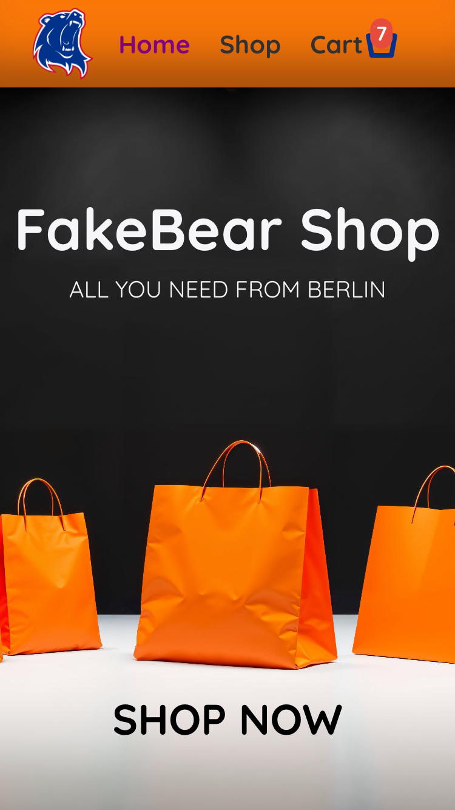

# Project: Shopping Cart

The **Shopping Cart** project is created according to the assignment from **The Odin Project** [course](https://www.theodinproject.com/paths/full-stack-javascript/courses/react).
 

This website is a basic mock-up of an e-commerce website that sells a wide range of products. It was a nice way of practicing my newly acquired React skills.

### 🔗 **Live preview** of the project is [here](https://berk-shopping-cart-app.netlify.app).

## **Built with**

- React
- React Router
- Vite

## **Features**

1. **Navigation**: On all pages, the user should see a navigation bar on top, which displays main pages as well as the number of items currently in the cart. Store page also provides sorting by item categories and navigation links for them.
2. **Cart**: The website has a cart feature where users can add items and then edit out their desired quantities on checkout. The cart is updated instantly and is passed down through StoreProvider.
3. **Image Loading Animation**: This way of loading images improves upon the user experience by providing loading animation also in line with the color themes of the website.
4. **Product Search**: The store page includes a search bar, allowing users to quickly find the products they are looking for. The search functionality is fast and reliable, checking for keywords in product titles and categories.

## Getting Started

In order to setup and work on this project on your own, you will need to:

1. Clone this project:  
   ssh: `git@github.com:berkgirgin/Shopping_Cart.git`
    
   https: `https://github.com/berkgirgin/Shopping_Cart.git`

2. Once you have cloned this project, you can install the required dependencies by using:  
   `npm install`

3. A live demo of the project can be started by using:  
   `npm run preview`

4. Distribution files can be produced using:  
   `npm run build`
